# NDE-OS Agent Runtime — Full Implementation Plan

All features from the R&D comparison, building everything. Phase 2 = only more channels/plugins/LLMs.

### Local Models Available

| File | Size | Use case |
|------|------|----------|
| `models/Qwen3.5-9B-Q4_K_M.gguf` | 5.2 GB | Primary local model |
| `models/qwen2.5-0.5b-instruct-q4_k_m.gguf` | 470 MB | Fast/lightweight tasks |

---

## Architecture

```mermaid
graph TB
    subgraph Channels
        NDE[NDE-OS Desktop Chat<br/>Svelte gateway]
        TG[Telegram Bot<br/>teloxide]
    end

    subgraph Agent Core
        AR[AgentRuntime<br/>state machine]
        SCHED[Scheduler<br/>cron + autonomous]
        STREAM[Streaming<br/>SSE/WS output]
    end

    subgraph LLM Providers
        LC[llama.cpp native<br/>GGUF direct load]
        OL[Ollama<br/>auto-launch from catalog]
        OA[OpenAI compat<br/>GPT, Groq, Together]
        CX[Codex<br/>OAuth2 flow]
    end

    subgraph Tools
        TR[ToolRegistry]
        FR[file_read]
        FW[file_write]
        SH[shell_exec]
        DT[Dynamic Tools<br/>runtime-loaded]
        MCC[MCP Client<br/>connect external]
        MCS[MCP Server<br/>expose NDE tools]
    end

    subgraph Skills & Knowledge
        SK[SKILL.md loader]
        SM[Skill Marketplace]
        KG[Knowledge Graph]
    end

    subgraph Memory
        CP[Conversation Store<br/>cross-channel]
        KV[Key-Value Store<br/>SQLite]
        VS[Vector Search<br/>sqlite-vec]
    end

    subgraph Security
        SB[Sandbox<br/>OS filesystem jail]
        PI[Prompt Injection<br/>scanner]
        CI[Credential Isolation<br/>env-per-sandbox]
        AT[Audit Trail<br/>Merkle-style log]
        CM[Compute Metering<br/>time + token limits]
    end

    NDE & TG --> AR
    AR --> SCHED
    AR --> STREAM
    AR --> LC & OL & OA & CX
    AR --> TR
    TR --> FR & FW & SH & DT & MCC
    AR --> MCS
    AR --> SK & KG
    SK --> SM
    AR --> CP & KV & VS
    FR & FW & SH --> SB
    AR --> PI
    AR --> CI
    AR --> AT & CM
    AR -->|response| NDE & TG
```



---

## 1. Core Dependencies

#### [MODIFY] [Cargo.toml](file:///c:/Users/dila/Downloads/ai-launcher-v0.2/ai-launcher/core/Cargo.toml)

```diff
 [dependencies]
+tokio = { version = "1", features = ["rt-multi-thread", "macros", "sync", "time", "process"] }
+reqwest = { version = "0.12", features = ["json"] }
+async-trait = "0.1"
+uuid = { version = "1", features = ["v4"] }
+toml = "0.8"
+teloxide = { version = "0.13", features = ["macros"] }
+rusqlite = { version = "0.31", features = ["bundled"] }
+llama_cpp = "0.3"
+sha2 = "0.10"
+glob = "0.3"
```

---

## 2. LLM Provider Layer

#### [NEW] `core/src/llm/mod.rs` — Trait + types

```rust
#[async_trait]
pub trait LlmProvider: Send + Sync {
    async fn chat(&self, messages: &[Message], tools: &[ToolDef]) -> Result<LlmResponse>;
    async fn chat_stream(&self, messages: &[Message], tools: &[ToolDef])
        -> Result<Pin<Box<dyn Stream<Item = Result<StreamChunk>>>>>;
}
```

#### [NEW] `core/src/llm/llama_native.rs` — Native llama.cpp (zero-dependency local inference)

~200 LOC. Uses `llama_cpp` crate to load GGUF models directly from `models/` directory. No Ollama, no Python, no external process. Streaming via token-by-token completion.

```rust
use llama_cpp::{LlamaModel, LlamaParams, SessionParams, StandardSampler};

pub struct LlamaNativeProvider {
    model: LlamaModel,
}

impl LlamaNativeProvider {
    pub fn new(model_path: &Path) -> Result<Self> {
        let model = LlamaModel::load_from_file(model_path, LlamaParams::default())?;
        Ok(Self { model })
    }
}

#[async_trait]
impl LlmProvider for LlamaNativeProvider {
    async fn chat(&self, messages: &[Message], tools: &[ToolDef]) -> Result<LlmResponse> {
        let prompt = self.format_chat_prompt(messages, tools);
        let mut session = self.model.create_session(SessionParams::default())?;
        session.advance_context(&prompt)?;
        let completions = session.start_completing_with(StandardSampler::default(), 4096);
        // parse tool calls from output...
    }
}
```

#### [NEW] `core/src/llm/ollama.rs` — Ollama HTTP (fallback / multi-model)

~120 LOC. `http://localhost:11434/api/chat`. Auto-detects running Ollama, launches via `app_manager` if not. Streaming via NDJSON. Useful when models aren't in `models/` dir.

#### [NEW] `core/src/llm/openai_compat.rs` — OpenAI-compatible API

~130 LOC. `POST /v1/chat/completions`. Works with OpenAI, Groq, Together, any compatible endpoint. SSE streaming.

#### [NEW] `core/src/llm/codex.rs` — Codex with OAuth

~180 LOC. OAuth2 authorization code flow → token exchange → API calls. Token refresh + secure storage via sandbox env-var isolation.

---

## 3. Agent Runtime

#### [NEW] `core/src/agent/mod.rs` — State machine (~250 LOC)

```rust
pub enum AgentState { Idle, Thinking, Acting, Observing }

impl AgentRuntime {
    pub async fn run(&mut self, user_message: &str) -> Result<String> {
        self.memory.save_message(Message::user(user_message)).await?;
        self.audit.log("user_message", user_message)?;

        for _ in 0..self.config.max_iterations {
            self.meter.check_budget()?;  // compute metering
            let input = self.injection_scanner.scan(&self.messages)?;
            let resp = self.provider.chat(&input, &self.tools.definitions()).await?;
            self.memory.save_message(Message::assistant(&resp)).await?;

            if resp.tool_calls.is_empty() {
                return Ok(resp.content.unwrap_or_default());
            }
            for call in &resp.tool_calls {
                let result = self.tools.execute(call, &self.sandbox).await?;
                self.audit.log("tool_call", &format!("{}: {}", call.name, result))?;
                self.memory.save_message(Message::tool_result(&call.id, &result)).await?;
            }
        }
        Err(anyhow!("Max iterations reached"))
    }
}
```

#### [NEW] `core/src/agent/config.rs` — TOML config (~100 LOC)

```toml
[agent]
name = "assistant"
max_iterations = 25
system_prompt = "You are a helpful assistant."

[model]
provider = "llama_native"     # llama_native | ollama | openai | codex
model = "models/qwen2.5-0.5b-instruct-q4_k_m.gguf"
# model = "models/Qwen3.5-9B-Q4_K_M.gguf"  # bigger model
# provider = "openai"
# base_url = "https://api.openai.com/v1"
# api_key_env = "OPENAI_API_KEY"

[tools]
enabled = ["file_read", "file_write", "shell_exec"]
mcp_servers = []              # MCP server URIs

[skills]
paths = ["./skills"]          # SKILL.md search paths

[memory]
db_path = "./memory.db"
vector_enabled = true

[security]
prompt_injection = true
audit_trail = true
max_tokens_per_turn = 100000
max_time_per_turn_secs = 300

[sandbox]
workspace = "./workspace"
```

#### [NEW] `core/src/agent/scheduler.rs` — Autonomous scheduling (~100 LOC)

Cron-like scheduling + event-driven triggers. Runs agent tasks on schedule or in response to app events.

#### [NEW] `core/src/agent/stream.rs` — Streaming output (~80 LOC)

SSE/WebSocket adapter for real-time token streaming to NDE-OS desktop chat and REST API.

---

## 4. Tool System

#### [NEW] `core/src/tools/mod.rs` — Registry + trait

```rust
#[async_trait]
pub trait Tool: Send + Sync {
    fn definition(&self) -> ToolDef;
    async fn execute(&self, args: Value, sandbox: &Sandbox) -> Result<String>;
}
pub struct ToolRegistry { tools: HashMap<String, Box<dyn Tool>> }
```

#### [NEW] `core/src/tools/builtin/` — 3 sandboxed tools

| Tool | Description | LOC |
|------|-------------|-----|
| `file_read.rs` | Read file via `Sandbox::resolve()` | ~50 |
| `file_write.rs` | Write file inside sandbox | ~50 |
| `shell_exec.rs` | Run command in sandbox | ~70 |

#### [NEW] `core/src/tools/dynamic.rs` — Dynamic tool loading (~80 LOC)

Load tool definitions at runtime from TOML/JSON specs. Enables apps to register custom tools.

#### [NEW] `core/src/tools/mcp_client.rs` — MCP client (~150 LOC)

Connect to external MCP servers, discover and proxy tool calls through the standard MCP protocol.

#### [NEW] `core/src/tools/mcp_server.rs` — MCP server (~150 LOC)

Expose NDE-OS tools (file_read, shell_exec, app catalog) as an MCP server for external agents.

---

## 5. Skills & Knowledge

#### [NEW] `core/src/skills/mod.rs` — SKILL.md loader (~100 LOC)

Parse SKILL.md files (YAML frontmatter + markdown body). Discovery across configured paths.

#### [NEW] `core/src/skills/marketplace.rs` — Skill marketplace (~120 LOC)

Registry for discovering, installing, and managing skills. Git-based or HTTP catalog.

#### [NEW] `core/src/knowledge/mod.rs` — Knowledge graph (~150 LOC)

Entity-relation store backed by SQLite. Agents can store and query knowledge across sessions.

---

## 6. Memory

#### [NEW] `core/src/memory/mod.rs` — Memory manager (~60 LOC)

Unified API for conversation persistence, KV store, and vector search.

#### [NEW] `core/src/memory/conversation.rs` — Conversation store (~100 LOC)

Cross-channel conversation persistence in SQLite. Each conversation has metadata + messages.

#### [NEW] `core/src/memory/kv.rs` — Key-value store (~80 LOC)

SQLite-backed KV store for agent state, user preferences, app config.

#### [NEW] `core/src/memory/vector.rs` — Vector search (~120 LOC)

sqlite-vec for semantic search over conversation history and knowledge base.

---

## 7. Channels

#### [NEW] `core/src/channels/mod.rs` — Channel trait

```rust
#[async_trait]
pub trait Channel: Send + Sync {
    async fn run(&self, agent_config: AgentConfig) -> Result<()>;
}
```

#### [NEW] `core/src/channels/nde_chat.rs` — NDE-OS Desktop Chat (**first channel**)

~200 LOC. REST endpoints for Svelte frontend:
- `POST /api/agent/chat` — send message, get response (or SSE stream)
- `GET /api/agent/status` — agent state
- `GET /api/agent/conversations` — conversation history

#### [NEW] `core/src/channels/telegram.rs` — Telegram Bot

~150 LOC using `teloxide`. Message handler with conversation persistence.

#### [NEW] `core/src/bin/agent_telegram.rs` — Binary entry point

---

## 8. Security

#### [NEW] `core/src/security/mod.rs` — Security coordinator (~30 LOC)

#### [NEW] `core/src/security/injection.rs` — Prompt injection scanner (~100 LOC)

Pattern-based + heuristic detection of injection attempts in user input and tool outputs.

#### [NEW] `core/src/security/audit.rs` — Audit trail (~100 LOC)

Append-only log with SHA-256 hash chain (Merkle-style). Every agent action, tool call, and LLM request logged.

#### [NEW] `core/src/security/metering.rs` — Compute metering (~80 LOC)

Per-turn and per-session limits on tokens, wall-clock time, and tool invocations.

---

## File Summary

| # | Status | File | LOC | Category |
|---|--------|------|-----|----------|
| 1 | MODIFY | `core/Cargo.toml` | +9 | Core |
| 2 | MODIFY | `core/src/lib.rs` | +8 | Core |
| 3 | NEW | `core/src/llm/mod.rs` | ~80 | LLM |
| 4 | NEW | `core/src/llm/llama_native.rs` | ~200 | LLM |
| 5 | NEW | `core/src/llm/ollama.rs` | ~120 | LLM |
| 6 | NEW | `core/src/llm/openai_compat.rs` | ~130 | LLM |
| 7 | NEW | `core/src/llm/codex.rs` | ~180 | LLM |
| 7 | NEW | `core/src/agent/mod.rs` | ~250 | Agent |
| 8 | NEW | `core/src/agent/config.rs` | ~100 | Agent |
| 9 | NEW | `core/src/agent/scheduler.rs` | ~100 | Agent |
| 10 | NEW | `core/src/agent/stream.rs` | ~80 | Agent |
| 11 | NEW | `core/src/tools/mod.rs` | ~100 | Tools |
| 12 | NEW | `core/src/tools/builtin/mod.rs` | ~30 | Tools |
| 13 | NEW | `core/src/tools/builtin/file_read.rs` | ~50 | Tools |
| 14 | NEW | `core/src/tools/builtin/file_write.rs` | ~50 | Tools |
| 15 | NEW | `core/src/tools/builtin/shell_exec.rs` | ~70 | Tools |
| 16 | NEW | `core/src/tools/dynamic.rs` | ~80 | Tools |
| 17 | NEW | `core/src/tools/mcp_client.rs` | ~150 | Tools |
| 18 | NEW | `core/src/tools/mcp_server.rs` | ~150 | Tools |
| 19 | NEW | `core/src/skills/mod.rs` | ~100 | Skills |
| 20 | NEW | `core/src/skills/marketplace.rs` | ~120 | Skills |
| 21 | NEW | `core/src/knowledge/mod.rs` | ~150 | Knowledge |
| 22 | NEW | `core/src/memory/mod.rs` | ~60 | Memory |
| 23 | NEW | `core/src/memory/conversation.rs` | ~100 | Memory |
| 24 | NEW | `core/src/memory/kv.rs` | ~80 | Memory |
| 25 | NEW | `core/src/memory/vector.rs` | ~120 | Memory |
| 26 | NEW | `core/src/channels/mod.rs` | ~30 | Channels |
| 27 | NEW | `core/src/channels/nde_chat.rs` | ~200 | Channels |
| 28 | NEW | `core/src/channels/telegram.rs` | ~150 | Channels |
| 29 | NEW | `core/src/bin/agent_telegram.rs` | ~40 | Channels |
| 30 | NEW | `core/src/security/mod.rs` | ~30 | Security |
| 31 | NEW | `core/src/security/injection.rs` | ~100 | Security |
| 32 | NEW | `core/src/security/audit.rs` | ~100 | Security |
| 33 | NEW | `core/src/security/metering.rs` | ~80 | Security |
| 34 | NEW | `agent.toml` | ~30 | Config |
| | | **Total** | **~3,700** | |

---

## Phase 2 (deferred — scale-out only)

- More channels: Discord, Slack, WhatsApp, web chat
- More LLM providers: Anthropic, Gemini, Mistral
- More tools/plugins: browser, search, code analysis
- Skill marketplace hosting

---

## Verification Plan

### Automated — ✅ ALL PASS (86 tests)

```bash
# Unit tests (58 pass)
cargo test -p ai-launcher-core -p ai-launcher-server
# test result: ok. 58 passed; 0 failed; 0 ignored

# Integration tests (28 pass)
cargo test -p ai-launcher-core --test integration_agent
# test result: ok. 28 passed; 0 failed; 0 ignored
```

#### Integration Test Coverage

| Subsystem | Tests | Description |
|-----------|-------|-------------|
| Memory (conversations) | 3 | Create, save messages, list, retrieve, conversation isolation |
| Memory (kv store) | 1 | Set, get, update, delete, missing key |
| Security (injection) | 4 | High severity blocked, medium flagged, clean passed, disabled mode |
| Security (audit) | 2 | Hash chain integrity verified, disabled no-ops |
| Security (metering) | 4 | Token limit, tool call limit, disabled mode, stats reporting |
| Tools (registry) | 1 | Default tools registered (file_read, file_write, shell_exec) |
| Tools (sandbox) | 3 | File write+read in sandbox, shell exec, path traversal blocked |
| Config | 4 | Defaults, partial TOML, full TOML, empty TOML |
| Knowledge graph | 1 | Entity CRUD, relations, search, upsert update |
| Skills | 2 | Discovery + search, empty directory handling |
| LLM factory | 3 | Ollama create, OpenAI create, unknown rejected |
| Agent runtime | 1 | Build from config |
| **Total** | **28** | **All real — no mocks, real SQLite, real filesystem** |

### Manual Verification (pending)
1. Start NDE-OS desktop → open chat panel → talk to agent → verify response
2. `cargo run -p ai-launcher-core --bin agent_telegram` → message Telegram bot
3. Ask agent to read/write files → verify sandbox containment
4. Check `memory.db` for conversation persistence
5. Inspect audit log for hash-chain integrity
6. Connect MCP client to NDE-OS MCP server → verify tool discovery
7. Feed prompt injection attempts → verify scanner blocks them

### API Endpoints (server verified compilation)

| Method | Endpoint | Status |
|--------|----------|--------|
| POST | `/api/agent/chat` | ✅ Compiled |
| GET | `/api/agent/conversations` | ✅ Compiled |
| GET | `/api/agent/conversations/{id}/messages` | ✅ Compiled |
| GET | `/api/agent/config` | ✅ Compiled |
| POST | `/api/apps` | ✅ Unit tested |
| GET | `/api/apps` | ✅ Unit tested |
| POST | `/api/store/upload` | ✅ Unit tested |
| GET | `/api/health` | ✅ Unit tested |
| GET | `/api/system` | ✅ Unit tested |

### LLM Providers (6 verified creatable)

| Provider | Config key | Status |
|----------|-----------|--------|
| Ollama | `ollama` | ✅ Factory test |
| OpenAI | `openai` | ✅ Factory test |
| Codex | `codex` | ✅ Compiled (env: CODEX_API_KEY) |
| Groq | `groq` | ✅ Compiled (env: GROQ_API_KEY) |
| Together | `together` | ✅ Compiled (env: TOGETHER_API_KEY) |
| Generic | `openai_compat` | ✅ Compiled (custom base_url) |

