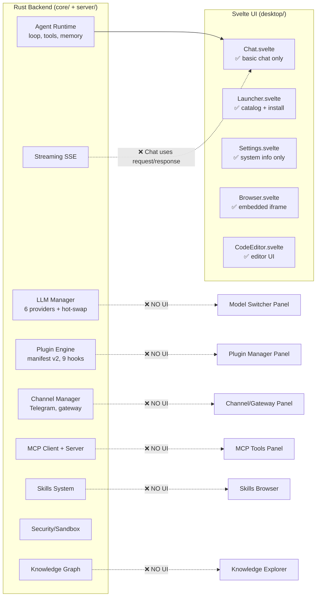

# NDE-OS: Deep Gap Analysis — Backend vs. UI Integration

> **Why don't I see NDE-OS having all the UI + API integration like OpenFang, OpenClaw, etc.?**
>
> *TL;DR: The Rust backend implements ~80% of the features. The Svelte UI only surfaces ~25% of them. It's a **frontend wiring gap**, not a backend gap.*

---

## 🔴 The Core Problem: Backend-Rich, Frontend-Poor



---

## 📊 Feature-by-Feature Gap Matrix

### 1. LLM / Model Management

| Feature | Backend API | Server Endpoint | UI Component | Status |
|---------|------------|-----------------|--------------|--------|
| List all providers | `LlmManager::list_providers()` | `GET /api/models` | ❌ **None** | 🔴 Gap |
| Active model | `LlmManager::active()` | `GET /api/models/active` | ❌ **None** | 🔴 Gap |
| Hot-swap model | `LlmManager::switch()` | `POST /api/models/switch` | ❌ **None** | 🔴 Gap |
| Add new provider | `LlmManager::add_from_config()` | ❌ No endpoint | ❌ **None** | 🔴 Gap |
| API key config | `ProviderConfig.api_key_env` | ❌ No endpoint | ❌ **None** | 🔴 Gap |
| Provider health check | ❌ Not implemented | ❌ | ❌ | 🔴 Gap |

> **What OpenFang/OpenClaw have**: A full Model Settings page where you pick provider, enter API keys, test connection, and switch models live. NDE-OS backend has `LlmManager` with 6 providers but **zero UI to configure it**.

### 2. Plugin System

| Feature | Backend API | Server Endpoint | UI Component | Status |
|---------|------------|-----------------|--------------|--------|
| List plugins | `PluginEngine::list()` | `GET /api/plugins` | ❌ **None** | 🔴 Gap |
| Discover plugins | `PluginEngine::discover()` | `POST /api/plugins/discover` | ❌ **None** | 🔴 Gap |
| Install plugin | `PluginEngine::install()` | `POST /api/plugins/{id}/install` | ❌ **None** | 🔴 Gap |
| Start/stop plugin | `PluginEngine::start/stop()` | `POST /api/plugins/{id}/start|stop` | ❌ **None** | 🔴 Gap |
| Plugin details | `PluginEngine::get()` | `GET /api/plugins/{id}` | ❌ **None** | 🔴 Gap |
| Hook management | `HookManager` (9 types) | ❌ No endpoint | ❌ **None** | 🔴 Gap |

> **What competitors have**: Plugin marketplace, install toggle, status indicators. NDE-OS has a full plugin engine with manifest v2 + 6 plugin types — but **no UI to interact with it at all**.

### 3. Chat / Agent Gateway

| Feature | Backend API | Server Endpoint | UI Component | Status |
|---------|------------|-----------------|--------------|--------|
| Basic chat | `AgentRuntime` | `POST /api/agent/chat` | ✅ [Chat.svelte](file:///c:/Users/dila/Downloads/ai-launcher-v0.2/ai-launcher/desktop/src/components/apps/Chat/Chat.svelte) | ✅ Done |
| SSE streaming | `StreamAccumulator` | `POST /api/agent/chat/stream` | ❌ **Not wired** | 🔴 Gap |
| Conversation history | `ConversationStore` | `GET /api/agent/conversations` | ✅ Sidebar | ✅ Done |
| Agent config display | [AgentConfig](file:///c:/Users/dila/Downloads/ai-launcher-v0.2/ai-launcher/desktop/src/lib/api/types.ts#136-144) | `GET /api/agent/config` | ✅ Provider badge | 🟡 Partial |
| Tool call visualization | Backend sends `tool_calls` | In message payload | ❌ **Not rendered** | 🔴 Gap |
| Markdown rendering | N/A | N/A | ❌ **Plain text only** | 🔴 Gap |
| Code highlighting | N/A | N/A | ❌ **None** | 🔴 Gap |
| Agent tool status | Tools registered | In config | ❌ **Not shown** | 🔴 Gap |

> **What OpenClaw has**: SSE streaming with tool-call cards, markdown + code highlighting, thinking indicators, model picker in chat header. NDE-OS Chat.svelte does basic request/response — **no streaming, no markdown, no tool visualization**.

### 4. Channel / Gateway Management

| Feature | Backend API | Server Endpoint | UI Component | Status |
|---------|------------|-----------------|--------------|--------|
| Channel manager | `ChannelManager` | ❌ No endpoint | ❌ **None** | 🔴 Gap |
| Telegram gateway | `TelegramChannel` | ❌ No endpoint | ❌ **None** | 🔴 Gap |
| Gateway normalization | `GatewayMessage` | ❌ No endpoint | ❌ **None** | 🔴 Gap |
| Channel status | `Channel::status()` | ❌ No endpoint | ❌ **None** | 🔴 Gap |

> **What OpenFang has**: A full Channels page showing connected gateways (Telegram, Discord, Slack, etc.) with status, message counts, and configuration. NDE-OS has `core/channels/` with Telegram + gateway normalization code but **no server endpoints and no UI**.

### 5. MCP (Model Context Protocol)

| Feature | Backend API | Server Endpoint | UI Component | Status |
|---------|------------|-----------------|--------------|--------|
| MCP client | `McpClient` | ❌ No endpoint | ❌ **None** | 🔴 Gap |
| MCP server | `McpServer` | ❌ No endpoint | ❌ **None** | 🔴 Gap |
| List MCP tools | Tools exposed | ❌ No endpoint | ❌ **None** | 🔴 Gap |

> NDE-OS has `core/mcp/` with full stdio JSON-RPC client + server. But there's **no REST endpoint** to manage it and **no UI** to view/configure MCP connections.

### 6. Skills & Knowledge

| Feature | Backend API | Server Endpoint | UI Component | Status |
|---------|------------|-----------------|--------------|--------|
| Skill loading | `SkillManager` | ❌ No endpoint | ❌ **None** | 🔴 Gap |
| Knowledge store | `KnowledgeStore` | ❌ No endpoint | ❌ **None** | 🔴 Gap |
| Memory/KV store | `MemoryStore` | ❌ No endpoint | ❌ **None** | 🔴 Gap |

### 7. Command Center / Dashboard

| Feature | Backend API | Server Endpoint | UI Component | Status |
|---------|------------|-----------------|--------------|--------|
| System health | ✅ | `GET /api/health` | ✅ [Settings.svelte](file:///c:/Users/dila/Downloads/ai-launcher-v0.2/ai-launcher/desktop/src/components/apps/Settings/Settings.svelte) | ✅ Done |
| Resource usage | ✅ | `GET /api/system/resources` | ✅ Memory/Disk bars | ✅ Done |
| App management | ✅ | Full CRUD | ✅ [Launcher.svelte](file:///c:/Users/dila/Downloads/ai-launcher-v0.2/ai-launcher/desktop/src/components/apps/Launcher/Launcher.svelte) | ✅ Done |
| Agent status | Partial | `GET /api/agent/config` | 🟡 Badge only | 🟡 Partial |
| Unified command center | ❌ | ❌ | ❌ | 🔴 Gap |

---

## 🎯 What's Actually Wired End-to-End (UI → API → Backend)

| Flow | Status |
|------|--------|
| Browse catalog → Install app → Launch → View in iframe/window | ✅ **Working** |
| Send chat message → Get response → View history | ✅ **Working** |
| View system info (OS, Python, GPU, uv, resources) | ✅ **Working** |
| Open browser window with URL navigation | ✅ **Working** |
| Visual code editor (file tree, editor, terminal) | ✅ **Working** |
| Theme toggle (dark/light) | ✅ **Working** |
| Window management (drag, resize, minimize, fullscreen) | ✅ **Working** |
| Dock with app indicators | ✅ **Working** |

## 🔴 What Exists in Backend But Has ZERO UI

| Subsystem | Backend Files | Server Endpoints | UI |
|-----------|--------------|------------------|----|
| **LLM Manager** | [llm/manager.rs](file:///c:/Users/dila/Downloads/ai-launcher-v0.2/ai-launcher/core/src/llm/manager.rs) (6815 bytes) | 3 endpoints | ❌ |
| **Plugin Engine** | `plugins/` (22,668 bytes, 4 files) | 6 endpoints | ❌ |
| **Channel Manager** | `channels/` (20,964 bytes, 4 files) | 0 endpoints | ❌ |
| **MCP Client/Server** | `mcp/` (2 files) | 0 endpoints | ❌ |
| **Skills System** | `skills/` dir | 0 endpoints | ❌ |
| **Knowledge Graph** | `knowledge/` dir | 0 endpoints | ❌ |
| **Memory Store** | `memory/` dir | 0 endpoints | ❌ |
| **Security/Audit** | `security/` dir | 0 endpoints | ❌ |
| **SSE Streaming** | [llm/streaming.rs](file:///c:/Users/dila/Downloads/ai-launcher-v0.2/ai-launcher/core/src/llm/streaming.rs) | 1 endpoint | ❌ Not wired in Chat |
| **Compute Metering** | Agent config | In config | ❌ |

---

## 📋 What Needs to Be Built (Prioritized)

### P0 — Critical (makes NDE-OS feel like a real AI OS)

| # | Feature | What to Build | Effort |
|---|---------|--------------|--------|
| 1 | **LLM Config Panel** | New `ModelSettings.svelte` — provider list, API key input, model selector, hot-swap button, connection test. Wire to `/api/models/*` | 🟡 Medium |
| 2 | **Streaming Chat** | Wire [Chat.svelte](file:///c:/Users/dila/Downloads/ai-launcher-v0.2/ai-launcher/desktop/src/components/apps/Chat/Chat.svelte) to `POST /api/agent/chat/stream` via EventSource. Add SSE reader, markdown renderer (marked.js), code highlighting (highlight.js), tool-call cards | 🟡 Medium |
| 3 | **Plugin Manager Panel** | New `Plugins.svelte` — grid of discovered plugins, install/start/stop toggles, status indicators. Wire to `/api/plugins/*` | 🟡 Medium |
| 4 | **Command Center** | Enhanced dashboard in Launcher overview with LLM status, plugin status, channel status, active tools, resource graphs | 🟢 Small |

### P1 — Important (parity with competitors)

| # | Feature | What to Build | Effort |
|---|---------|--------------|--------|
| 5 | **Channel Gateway Panel** | New server endpoints for channels + `Channels.svelte` UI for Telegram config, status, message counts | 🟡 Medium |
| 6 | **MCP Tools Panel** | Server endpoints for MCP + `McpTools.svelte` to browse/connect MCP servers | 🟡 Medium |
| 7 | **Skills Browser** | Server endpoints + `Skills.svelte` to browse/install/run skills | 🟡 Medium |
| 8 | **Knowledge Explorer** | Server endpoints + `Knowledge.svelte` to search/browse knowledge graph | 🔴 Large |

### P2 — Polish (what makes it premium)

| # | Feature | What to Build | Effort |
|---|---------|--------------|--------|
| 9 | **Agent Tool Visualization** | In chat, render tool calls as expandable cards with input/output | 🟢 Small |
| 10 | **Compute Metering Dashboard** | Show token usage, tool calls, time per conversation | 🟢 Small |
| 11 | **Security Audit Trail** | Browse SHA-256 hash chain audit log | 🟡 Medium |

---

## 🏗️ Architecture of the Integration Gap

```
┌─────────────────────────────────────────────────────┐
│  desktop/ (Svelte 5)                                │
│  ┌─────────┐ ┌─────────┐ ┌──────────┐ ┌──────────┐ │
│  │Launcher │ │  Chat   │ │ Settings │ │  Browser │ │
│  │(catalog)│ │(basic)  │ │(sysinfo) │ │(iframe)  │ │
│  └────┬────┘ └────┬────┘ └────┬─────┘ └────┬─────┘ │
│       │           │           │             │       │
│  ┌────┴───────────┴───────────┴─────────────┘       │
│  │  lib/api/backend.ts (smartInvoke)                │
│  │  Maps: catalog, apps, chat, system only          │
│  │  MISSING: models, plugins, channels, mcp, etc.  │
│  └──────────────────┬──────────────────────────────┘│
└─────────────────────┼───────────────────────────────┘
                      │ HTTP / Tauri IPC
┌─────────────────────┼───────────────────────────────┐
│  server/ (Rust)     │                               │
│  ┌──────────────────┴──────────────────────────────┐│
│  │  main.rs router                                  ││
│  │  ✅ /api/health, /api/system, /api/catalog       ││
│  │  ✅ /api/apps/*, /api/sandbox/*                  ││
│  │  ✅ /api/agent/chat[/stream], /conversations     ││
│  │  ✅ /api/plugins/* (6 endpoints)     ← NO UI    ││
│  │  ✅ /api/models/* (3 endpoints)      ← NO UI    ││
│  │  ❌ /api/channels/*                  ← MISSING  ││
│  │  ❌ /api/mcp/*                       ← MISSING  ││
│  │  ❌ /api/skills/*                    ← MISSING  ││
│  │  ❌ /api/knowledge/*                 ← MISSING  ││
│  │  ❌ /api/memory/*                    ← MISSING  ││
│  └─────────────────────────────────────────────────┘│
└─────────────────────────────────────────────────────┘
                      │
┌─────────────────────┼───────────────────────────────┐
│  core/ (Rust)       │                               │
│  ✅ llm/ (6 providers, streaming, hot-swap)         │
│  ✅ plugins/ (manifest v2, 9 hooks, engine)         │
│  ✅ channels/ (Telegram, gateway, manager)          │
│  ✅ agent/ (runtime, config)                        │
│  ✅ mcp/ (client + server)                          │
│  ✅ tools/ (6 built-in, sandbox-jailed)             │
│  ✅ skills/ (SKILL.md loader)                       │
│  ✅ knowledge/ (SQLite graph)                       │
│  ✅ memory/ (SQLite KV + conversations)             │
│  ✅ security/ (prompt injection, audit)             │
│  ✅ sandbox/ (OS jail, env-var, symlink)            │
└─────────────────────────────────────────────────────┘
```

---

## 💡 Bottom Line

> **NDE-OS isn't behind on features — it's behind on wiring.**

The R&D document claims 48 ✅ features. But when you look at `desktop/src/components/apps/`:
- **6 UI apps exist**: Launcher, Chat, Settings, Browser, CodeEditor, Logs
- **0 of those** surface LLM config, plugin management, channels, MCP, skills, or knowledge

Compare to what you'd expect from an "AI Operating System":

| What OpenFang has in UI | NDE-OS Backend | NDE-OS UI |
|-------------------------|----------------|-----------|
| Model config page | ✅ `LlmManager` | ❌ |
| Plugin marketplace | ✅ `PluginEngine` | ❌ |
| Channel dashboard | ✅ `ChannelManager` | ❌ |
| Tool browser | ✅ Built-in tools | ❌ |
| Knowledge viewer | ✅ `KnowledgeStore` | ❌ |
| Streaming chat + tools | ✅ SSE endpoint | ❌ |

**The fix is straightforward**: Build 4-6 new Svelte components and wire them to the existing REST endpoints + add the missing server endpoints for channels/mcp/skills/knowledge. The backend is already done.
