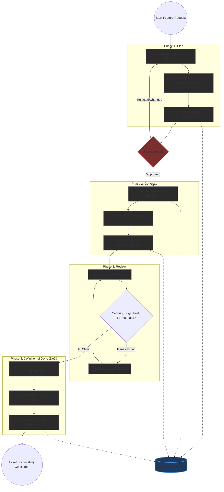

# Tickets Writer Workflow Reference

This diagram outlines the complete 4-phase ticketing scrum process governing the `tickets-writer` skill.

```mermaid
graph TD
    classDef phase fill:#2b2b2b,stroke:#a8a8a8,stroke-width:2px;
    classDef approval fill:#7a2e2e,stroke:#ff6b6b,stroke-width:2px;
    classDef file fill:#1e3a5f,stroke:#4a90e2,stroke-width:2px;

    Start((Start Feature Request)) --> P1

    subgraph "Phase 1: Plan"
        P1[Complete Planning Template]:::phase --> P1_Disk[Write to .agents/tasks/feature-name.md]:::phase
        P1_Disk --> P1_Status[Set Status: 🔴 waiting-approval]:::phase
    end
    
    P1_Status -.-> File[(Ticket Markdown File)]:::file

    P1_Status --> Wait{User Approval?}:::approval
    
    Wait -- "Rejected/Changes" --> P1
    Wait -- "'approved'" --> P2_Status
    
    subgraph "Phase 2: Generate"
        P2_Status[Update Status: 🟡 in-progress]:::phase --> P2_Gen[Generate Stack-Specific Code]:::phase
        P2_Gen --> P2_Sync[Continuously Update Sub-Task Checklist]:::phase
    end
    
    P2_Status -.-> File
    P2_Sync -.-> File

    P2_Sync --> P3_Review
    
    subgraph "Phase 3: Review"
        P3_Review[Automated Self-Review]:::phase --> P3_Checks{Security, Bugs, Perf, Format pass?}
        P3_Checks -- "Issues Found" --> P3_Fix[Fix Issues Immediately]:::phase
        P3_Fix --> P3_Review
    end
    
    P3_Checks -- "All Clear" --> P4_Local
    
    subgraph "Phase 4: Definition of Done (DoD)"
        P4_Local[Verify Local DoD Constraints]:::phase --> P4_Global[Verify AGENTS.md Global DoD]:::phase
        P4_Global --> P4_Done[Update Status: 🟢 done + check items]:::phase
    end
    
    P4_Done -.-> File
    
    P4_Done --> End((Ticket Successfully Concluded))
```
