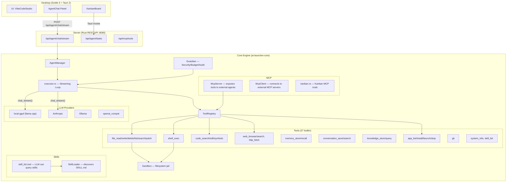

# NDE-OS Core Architecture Audit — LLM + Skills + MCP + Tools

> Openclaw + Pinokio combined — a sandboxed virtual OS for AI applications with an autonomous agent gateway.

---

## Architecture Overview



---

## How Data Flows

### 1. Chat → LLM → Tools Loop

```
User types in Chat
  → POST /api/agent/chat/stream { message }
    → AgentManager.spawn(message)
      → executor::execute_task()
        → Guardian.check_input() — injection scan
        → LOOP:
          → provider.chat_stream(messages, tool_defs) — streams tokens back via SSE
          → IF tool_calls in response:
            → Guardian.authorize_tool()
            → ToolRegistry.execute(call, sandbox)
            → Append tool_result to messages
            → Continue loop
          → IF no tool_calls:
            → Return final text → SSE "done" event
```

### 2. Frontend Tool-Calling (Scrum Mode)

```
User types in Chat (scrum mode)
  → POST /api/agent/chat/stream — LLM generates text
  → Frontend parses JSON codeblocks for tool calls
  → Frontend executes via Tauri invoke (create_agent_task, etc.)
  → Frontend feeds result back to LLM as "System observation"
  → Continue loop (up to 5 turns)
```

> [!IMPORTANT]
> **Two parallel tool systems exist!**  
> The backend's `ToolRegistry` has 27 tools the LLM can call natively via the executor loop.  
> The frontend's `AgentChat.svelte` has its own regex-based tool parser for Kanban operations.  
> These are **not connected** — the Kanban tools in the frontend bypass the backend entirely.

### 3. MCP (Model Context Protocol)

```
External Agent (Claude Code, Cursor, etc.)
  → Connects to NDE-OS MCP Server (stdio)
    → McpServer.handle_request(JSON-RPC)
      → tools/list → returns registered tool schemas
      → tools/call → dispatches to ToolRegistry.execute()
        OR → kanban.rs handles nde_kanban_* calls directly
```

```
NDE-OS Agent
  → Connects to external MCP servers via McpClient (stdio)
    → client.discover_tools() → returns remote tool defs
    → client.call_tool(name, args) → JSON-RPC to remote server
```

---

## Architecture Analysis

### ✅ What's Already Solid

| Component | Status | Notes |
|---|---|---|
| **LLM multi-provider** | ✅ Production | GGUF, Anthropic, Ollama, OpenAI — auto-selected |
| **27 builtin tools** | ✅ Production | File, shell, code, web, git, memory, knowledge, app |
| **Sandbox** | ✅ Production | Filesystem jail, path canonicalization, env jailing |
| **Executor** | ✅ Production | Streaming, Guardian, retry, cancellation, checkpoints |
| **MCP Server** | ✅ Working | Exposes tools to external agents |
| **MCP Client** | ✅ Working | Connects to external MCP servers |
| **Skills discovery** | ✅ Working | SkillLoader + skill_list tool |
| **Kanban (backend)** | ✅ Working | kanban.rs with full MCP tool definitions |

### ⚠️ Gaps / Disconnections

| Issue | Impact | Fix |
|---|---|---|
| **Kanban tools NOT in ToolRegistry** | Backend agent can't autonomously manage Kanban tasks; only frontend does it via regex parsing | Register Kanban tools in `default_registry()` |
| **Skills not injected into system prompt** | `SkillLoader` discovers skills, `skill_list` tool lets LLM query them, but skills are NOT auto-injected into the agent's system prompt | Load relevant skills and inject into `AgentConfig.system_prompt` |
| **Frontend tool loop is a shadow copy** | AgentChat.svelte has its own tool execution (separate from backend ToolRegistry) | Either: (a) let the backend handle Kanban tools natively, or (b) keep frontend as the "glue layer" — current approach is (b) and it works |
| **MCP Client not wired to agent** | McpClient can discover & call external tools, but the **agent executor** doesn't include external MCP tools in its tool_defs | Merge MCP-discovered tools into ToolRegistry at startup |

### 🏗️ Current vs. Ideal Architecture

**Current flow** (Kanban via Chat):
```
User → AgentChat (frontend) → LLM (backend) → text with JSON codeblock
    → Frontend regex-parses JSON → Frontend calls Tauri invoke → result
    → Frontend sends result back to LLM → repeat
```

**Ideal flow** (tools inside executor):
```
User → POST /api/agent/chat/stream → AgentManager → Executor
    → LLM natively calls `kanban_create_task` tool
    → Executor dispatches to ToolRegistry → Kanban tool runs in sandbox
    → Result appended to messages → LLM continues → SSE streams to frontend
```

> [!NOTE]  
> The current "frontend as glue" approach **works fine** for the Kanban use case.  
> The "ideal" approach would eliminate the frontend tool loop entirely but requires registering Kanban tools in the backend ToolRegistry. This is a v0.3+ optimization.

---

## Summary

The core architecture is **production-grade and well-structured**:
- **LLM → Tool → LLM** loop works natively in the executor with 27 builtin tools
- **MCP** bidirectional (server + client) is implemented
- **Skills** are discoverable and queryable by the agent
- **Sandbox** properly jails all file/shell operations

The main **architectural gap** is that Kanban operations currently live in a **frontend-only tool loop** separate from the backend executor. To fully unify, Kanban tools should be registered in the `ToolRegistry` so the backend agent can autonomously manage tasks without frontend intermediation. The `/add` slash command now properly delegates template generation to the LLM instead of hardcoding in Rust.
