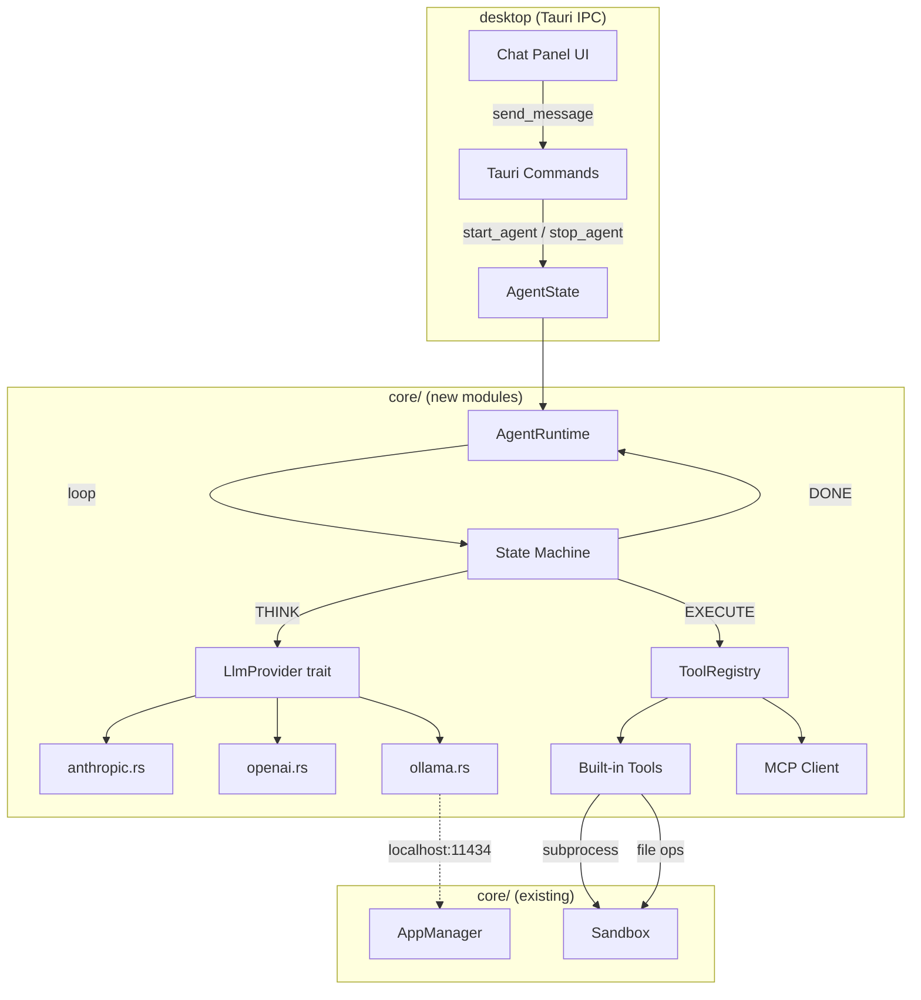

# Phase 1: Agent Runtime Implementation Plan

Build an autonomous agent loop inside `core/` that reuses the existing sandbox + app_manager infrastructure. Provider-pattern traits for LLM backends and tools so components are individually swappable.

---

## Architecture



---

## Proposed Changes

### Core: Dependencies

#### [MODIFY] [Cargo.toml](file:///c:/Users/dila/Downloads/ai-launcher-v0.2/ai-launcher/core/Cargo.toml)

Add async runtime + HTTP client + TOML support:

```diff
 [dependencies]
 serde = { version = "1.0.197", features = ["derive"] }
 serde_json = "1.0.114"
 anyhow = "1.0.81"
 chrono = "0.4.35"
 sysinfo = { version = "0.30.13", default-features = false }
+tokio = { version = "1", features = ["rt-multi-thread", "macros", "sync", "time"] }
+reqwest = { version = "0.12", features = ["json", "stream"] }
+toml = "0.8"
+async-trait = "0.1"
+uuid = { version = "1", features = ["v4"] }
```

---

### Core: LLM Provider Layer

#### [NEW] [mod.rs](file:///c:/Users/dila/Downloads/ai-launcher-v0.2/ai-launcher/core/src/llm/mod.rs)

`LlmProvider` trait — the swappable interface:

```rust
#[async_trait]
pub trait LlmProvider: Send + Sync {
    async fn chat(&self, messages: &[Message], tools: &[ToolDef]) -> Result<LlmResponse>;
    fn name(&self) -> &str;
}

pub struct LlmResponse {
    pub content: Option<String>,
    pub tool_calls: Vec<ToolCall>,
    pub usage: TokenUsage,
    pub stop_reason: StopReason,
}
```

#### [NEW] [anthropic.rs](file:///c:/Users/dila/Downloads/ai-launcher-v0.2/ai-launcher/core/src/llm/anthropic.rs)

First driver. Maps our `Message`/`ToolDef` types to Anthropic's API format. ~150 LOC.
- Uses `reqwest` for HTTP
- Reads `ANTHROPIC_API_KEY` from env
- Supports streaming (optional, via `reqwest::Response::bytes_stream`)

#### [NEW] [openai.rs](file:///c:/Users/dila/Downloads/ai-launcher-v0.2/ai-launcher/core/src/llm/openai.rs)

Same trait impl for OpenAI's chat completion API. ~120 LOC. Also covers Groq (same API shape, different base URL).

#### [NEW] [ollama.rs](file:///c:/Users/dila/Downloads/ai-launcher-v0.2/ai-launcher/core/src/llm/ollama.rs)

Points to `localhost:11434` (Ollama's default). Ollama is already in our app catalog — `app_manager.launch("ollama")` starts it. ~100 LOC.

---

### Core: Agent Runtime

#### [NEW] [mod.rs](file:///c:/Users/dila/Downloads/ai-launcher-v0.2/ai-launcher/core/src/agent/mod.rs)

The main loop. State machine:

```
IDLE → THINKING → ACTING → OBSERVING → THINKING → ... → DONE
```

```rust
pub struct AgentRuntime {
    config: AgentConfig,
    provider: Box<dyn LlmProvider>,
    tools: ToolRegistry,
    sandbox: Sandbox,
    state: ConversationState,
}

impl AgentRuntime {
    pub async fn run(&mut self, user_message: &str) -> Result<AgentResponse> {
        self.state.push(Message::user(user_message));
        
        for _ in 0..self.config.max_iterations {
            let response = self.provider.chat(&self.state.messages, &self.tools.definitions()).await?;
            
            if response.tool_calls.is_empty() {
                // DONE — final text response
                return Ok(AgentResponse::from(response));
            }
            
            // EXECUTE tools in sandbox
            for call in &response.tool_calls {
                let result = self.tools.execute(call, &self.sandbox).await?;
                self.state.push(Message::tool_result(call.id, result));
            }
        }
        
        Err(anyhow!("Max iterations ({}) reached", self.config.max_iterations))
    }
}
```

#### [NEW] [state.rs](file:///c:/Users/dila/Downloads/ai-launcher-v0.2/ai-launcher/core/src/agent/state.rs)

Conversation state: message history, token counting, context window management. ~100 LOC.

#### [NEW] [config.rs](file:///c:/Users/dila/Downloads/ai-launcher-v0.2/ai-launcher/core/src/agent/config.rs)

TOML agent manifest parser (~80 LOC):

```toml
[agent]
name = "researcher"
description = "Web research + report generation"
max_iterations = 50

[model]
provider = "anthropic"
model = "claude-sonnet-4-20250514"
fallback = ["openai:gpt-4o", "ollama:llama3"]

[tools]
enabled = ["file_read", "file_write", "shell_exec", "web_fetch", "python_exec"]
```

---

### Core: Tool System

#### [NEW] [mod.rs](file:///c:/Users/dila/Downloads/ai-launcher-v0.2/ai-launcher/core/src/tools/mod.rs)

`ToolRegistry` — discovers tools, dispatches calls, enforces sandbox:

```rust
pub struct ToolRegistry {
    tools: HashMap<String, Box<dyn Tool>>,
}

#[async_trait]
pub trait Tool: Send + Sync {
    fn definition(&self) -> ToolDef;
    async fn execute(&self, args: serde_json::Value, sandbox: &Sandbox) -> Result<String>;
}
```

#### [NEW] [builtin/](file:///c:/Users/dila/Downloads/ai-launcher-v0.2/ai-launcher/core/src/tools/builtin/)

5 starter tools (each ~50–80 LOC):

| Tool | What It Does |
|------|-------------|
| `file_read` | Read file contents within sandbox |
| `file_write` | Write/append file within sandbox |
| `shell_exec` | Run shell command inside sandbox (reuses `app_manager` subprocess pattern) |
| `web_fetch` | HTTP GET a URL, return text content |
| `python_exec` | Execute Python script using sandbox's uv venv |

All file/shell tools use `Sandbox::resolve()` for path validation — **the safety layer is already built**.

---

### Core: lib.rs Update

#### [MODIFY] [lib.rs](file:///c:/Users/dila/Downloads/ai-launcher-v0.2/ai-launcher/core/src/lib.rs)

```diff
 pub mod app_manager;
 pub mod manifest;
 pub mod sandbox;
 pub mod system_metrics;
 pub mod uv_env;
+pub mod agent;
+pub mod llm;
+pub mod tools;
```

---

### Desktop: Tauri Commands

#### [NEW] [agent.rs](file:///c:/Users/dila/Downloads/ai-launcher-v0.2/ai-launcher/desktop/src-tauri/src/commands/agent.rs)

4 new Tauri commands:

| Command | Purpose |
|---------|---------|
| `start_agent` | Create AgentRuntime from TOML config, store in state |
| `stop_agent` | Stop a running agent session |
| `send_message` | Send user message → run agent loop → return response |
| `get_agent_status` | Return agent state (idle/thinking/acting/done) |

#### [MODIFY] [state.rs](file:///c:/Users/dila/Downloads/ai-launcher-v0.2/ai-launcher/desktop/src-tauri/src/state.rs)

Add `AgentRuntime` storage alongside existing [AppManager](file:///c:/Users/dila/Downloads/ai-launcher-v0.2/ai-launcher/core/src/app_manager/mod.rs#11-17):

```diff
 pub struct AppState {
     pub manager: SharedAppManager,
+    pub agents: Arc<Mutex<HashMap<String, AgentRuntime>>>,
     pub base_dir: PathBuf,
 }
```

#### [MODIFY] [lib.rs](file:///c:/Users/dila/Downloads/ai-launcher-v0.2/ai-launcher/desktop/src-tauri/src/lib.rs)

Register new commands in the invoke handler.

---

### Desktop: Agent Chat UI

#### [NEW] [AgentChat.svelte](file:///c:/Users/dila/Downloads/ai-launcher-v0.2/ai-launcher/desktop/src/components/apps/AgentChat.svelte)

A chat panel component (shadcn + Tailwind):
- Message list (user/assistant/tool-result bubbles)
- Input bar with send button
- Agent status indicator (thinking spinner, tool execution display)
- Config selector (pick agent TOML profile)

This integrates into the existing desktop window system — opens like any other app window.

---

## File Summary

| Status | File | LOC (est.) |
|--------|------|-----------|
| MODIFY | [core/Cargo.toml](file:///c:/Users/dila/Downloads/ai-launcher-v0.2/ai-launcher/core/Cargo.toml) | +5 |
| MODIFY | [core/src/lib.rs](file:///c:/Users/dila/Downloads/ai-launcher-v0.2/ai-launcher/core/src/lib.rs) | +3 |
| NEW | `core/src/llm/mod.rs` | ~80 |
| NEW | `core/src/llm/anthropic.rs` | ~150 |
| NEW | `core/src/llm/openai.rs` | ~120 |
| NEW | `core/src/llm/ollama.rs` | ~100 |
| NEW | `core/src/agent/mod.rs` | ~200 |
| NEW | `core/src/agent/state.rs` | ~100 |
| NEW | `core/src/agent/config.rs` | ~80 |
| NEW | `core/src/tools/mod.rs` | ~120 |
| NEW | `core/src/tools/builtin/mod.rs` | ~50 |
| NEW | `core/src/tools/builtin/file_read.rs` | ~60 |
| NEW | `core/src/tools/builtin/file_write.rs` | ~60 |
| NEW | `core/src/tools/builtin/shell_exec.rs` | ~80 |
| NEW | `core/src/tools/builtin/web_fetch.rs` | ~50 |
| NEW | `core/src/tools/builtin/python_exec.rs` | ~70 |
| MODIFY | [desktop/src-tauri/Cargo.toml](file:///c:/Users/dila/Downloads/ai-launcher-v0.2/ai-launcher/desktop/src-tauri/Cargo.toml) | +2 |
| MODIFY | [desktop/src-tauri/src/state.rs](file:///c:/Users/dila/Downloads/ai-launcher-v0.2/ai-launcher/desktop/src-tauri/src/state.rs) | +5 |
| MODIFY | [desktop/src-tauri/src/lib.rs](file:///c:/Users/dila/Downloads/ai-launcher-v0.2/ai-launcher/desktop/src-tauri/src/lib.rs) | +8 |
| NEW | `desktop/src-tauri/src/commands/agent.rs` | ~120 |
| NEW | `desktop/src/components/apps/AgentChat.svelte` | ~200 |
| | **Total new code** | **~1,880** |

---

## Verification Plan

### Automated Tests

```bash
# Unit tests for agent loop + LLM mock
cargo test -p ai-launcher-core -- agent

# Unit tests for tool execution in sandbox
cargo test -p ai-launcher-core -- tools

# Desktop tauri command tests
cargo test -p ai-launcher-desktop -- agent
```

### Manual Verification

1. Start desktop with `pnpm dev` (desktop) + `cargo tauri dev`
2. Open agent chat panel from dock
3. Configure with Anthropic API key
4. Send a message → verify agent loop runs → get response
5. Send tool-using prompt → verify tool executes inside sandbox
6. Verify sandbox containment: agent file ops stay within workspace
